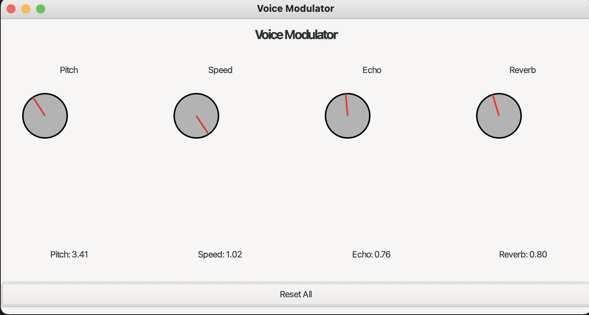
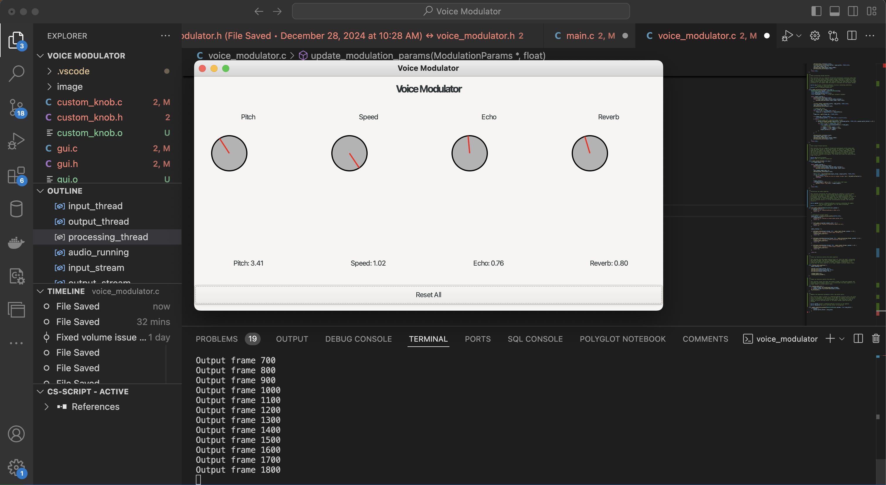

# Voice-Modulator
Voice Modulator application that processes real-time audio input with various effects. The program is specifically optimized for macOS M2 Pro processors but maintains cross-platform compatibility through its use of portable libraries and frameworks.

# Core Functionality:
* Real-time audio input/output processing
* Voice modulation effects including:
- Pitch shifting
- Speed adjustment
- Echo
- Reverb
* GUI interface with interactive knob controls
* Multi-threaded audio processing pipeline

# Technologies and Libraries Used:
* Audio Processing:
- PortAudio: Cross-platform audio I/O library
- FFTW3: Fast Fourier Transform library for spectral processing
- Phase vocoder algorithm for pitch/time manipulation
* GUI:
- GTK+3: GUI toolkit for creating the interface
- Cairo: 2D graphics library for drawing custom knob widgets
* System Integration:
- CoreAudio/AudioToolbox/AudioUnit: macOS-specific audio frameworks
- POSIX Threads (pthread): Multi-threading support
- OpenMP: Parallel processing optimization

# Development Tools/Features:
- GCC 14 compiler
- Advanced ARM processor optimizations (specific to M2 Pro)
- Make build system

# Architecture:
* Audio Pipeline:
- Input Thread: Captures audio from microphone
- Processing Thread: Applies effects using phase vocoder
- Output Thread: Plays processed audio
- Circular buffer for thread synchronization

# GUI Components:
* Custom rotary knobs for parameter control
* Real-time parameter display
* Reset functionality
* Window management

# Performance Optimizations:
* Multi-threaded audio processing
* Compiler optimizations for ARM architecture
* FFT-based spectral processing

# Testing Environment: MacOS, M2Pro, gcc-14

# GUI-Demo Pictures

# Citations
https://en.wikipedia.org/wiki/Phase_vocoder
https://www.portaudio.com/docs.html
https://github.com/oramics/dsp-kit/blob/master/docs/phase-vocoder.md
