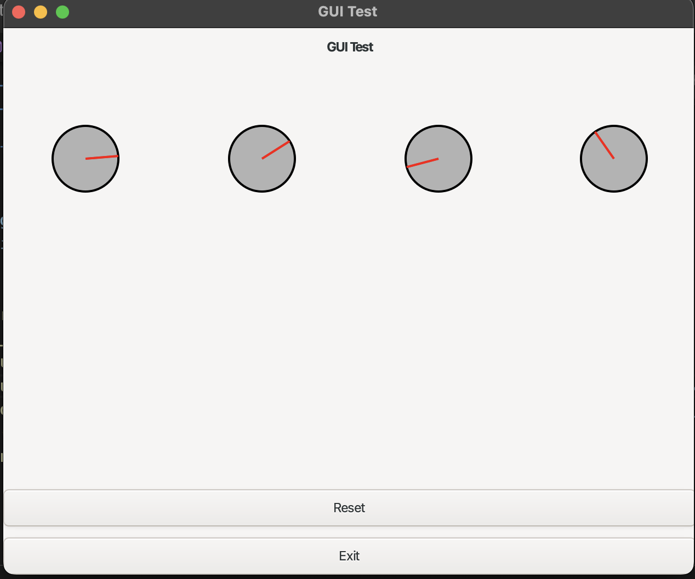

# Voice-Modulator
Voice Modulator library in C, along with a GUI for shifting the parameters of the modulator (pitch, echo, etc.)

# Progress Picture

# Citations
https://en.wikipedia.org/wiki/Phase_vocoder
https://www.portaudio.com/docs.html
https://github.com/oramics/dsp-kit/blob/master/docs/phase-vocoder.md
